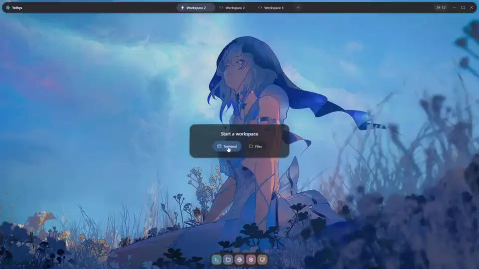
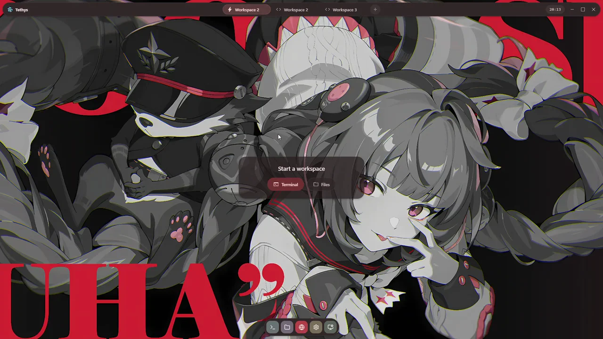
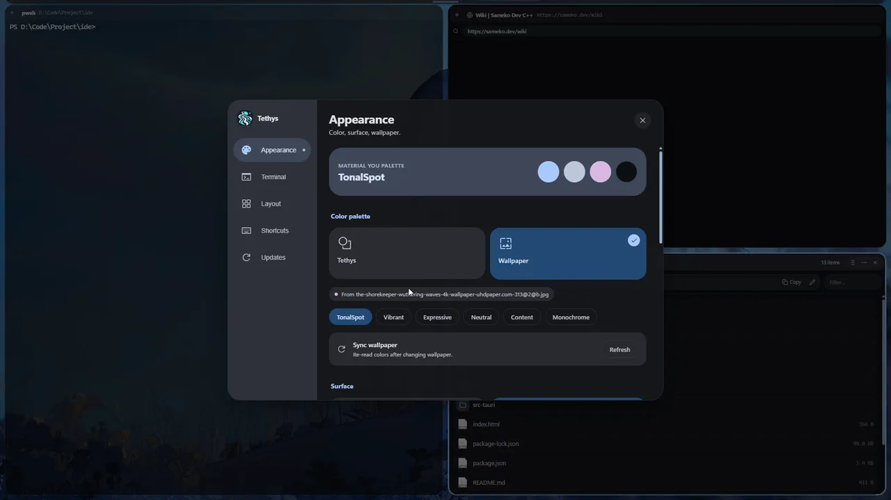
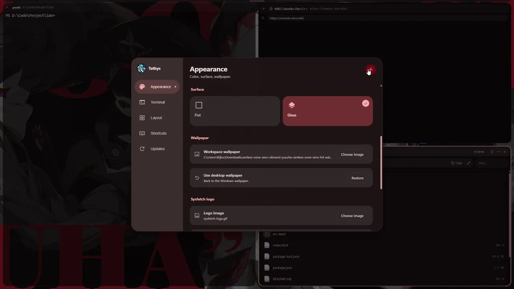

<div align="center">
  <br />
  

  # 🪼 Tethys 🌊

  **A dedicated Linux-style tiling workspace on Windows, built for modern developers and AI agents.**

  [](https://github.com/QuangquyNguyenvo/Tethys/releases/latest)
  [](https://github.com/QuangquyNguyenvo/Tethys)
  [](LICENSE)

  <br />
  
</div>

## 💡 Why Tethys

**Coding with AI agents changes how we interact with our workspace.**

> When tools like `claude`, `codex`, or `aider` write code, modify specs, and run background jobs all at once, a standard terminal is no longer enough. On Windows, tracking these actions usually means endless Alt-Tabbing across editors, diff tools, and file explorers just to see what the agent changed.

<div align="center">
  
</div>

**Tethys brings the power and fluid tiling of a Linux desktop directly to Windows.**

> Terminal sessions, live markdown previews, image inspectors, and git diffs live together on one responsive canvas. The instant an agent updates a file or drops a diff, it renders side by side in real time, keeping you completely in your flow without overlapping window clutter.

<div align="center">
  <a href="assets/demo/tethys-demo.mp4">
    
  </a>
</div>


## ⚡ Highlights

<table>
  <tr>
    <td width="50%">
      <h3>Flexible Tiling Canvas</h3>
      <p>Split panels horizontally or vertically, drag to rearrange, and resize freely. Keep your agent output, editor, and tools in a single unified view.</p>
    </td>
    <td width="50%">
      <h3>Instant Live Previews</h3>
      <p>Inspect markdown documents, images, and file modifications the moment your agent creates or updates them, without manual refreshes.</p>
    </td>
  </tr>
  <tr>
    <td width="50%">
      <h3>Multiple Workspaces</h3>
      <p>Keep independent project layouts running in parallel. Switch between dedicated workspaces smoothly using keyboard shortcuts.</p>
    </td>
    <td width="50%">
      <h3>Embedded Explorer & Web</h3>
      <p>Browse project directories, inspect local ports, and view web previews directly alongside your terminal sessions.</p>
    </td>
  </tr>
  <tr>
    <td width="50%">
      <h3>Fast & Responsive Terminal</h3>
      <p>Hardware-accelerated rendering with crisp text, smooth scrollback, and instant command feedback.</p>
    </td>
    <td width="50%">
      <h3>Modern Adaptive Aesthetics</h3>
      <p>Native Windows acrylic and mica effects paired with dynamic themes extracted directly from your wallpaper.</p>
    </td>
  </tr>
</table>


## 🖥️ Interface & Workspaces

<table>
  <tr>
    <td width="50%" align="center">
      
      <p><b>Launch Workspace</b><br />Clean terminal sessions and file navigation.</p>
    </td>
    <td width="50%" align="center">
      
      <p><b>Workspace Management</b><br />Isolate tasks across dedicated workspaces.</p>
    </td>
  </tr>
  <tr>
    <td width="50%" align="center">
      
      <p><b>Deep Customization</b><br />Fine-tune colors, surfaces, and shortcuts.</p>
    </td>
    <td width="50%" align="center">
      
      <p><b>Dynamic Theming</b><br />Adaptive palettes from your wallpaper.</p>
    </td>
  </tr>
</table>


## 🚀 Getting Started

Download the latest release from [GitHub Releases](https://github.com/QuangquyNguyenvo/Tethys/releases/latest). Choose the package that best fits your workflow:

| Package | File | Best For | Description |
| :--- | :--- | :--- | :--- |
| **Installer** *(Recommended)* | [`Tethys_x64.msi`](https://github.com/QuangquyNguyenvo/Tethys/releases/latest) | Daily Driver | Standard Windows installer. Creates Start Menu shortcut, desktop icon, and system integration. |
| **Portable** | [`Tethys_portable.zip`](https://github.com/QuangquyNguyenvo/Tethys/releases/latest) | Portable / USB | Zero installation. Extract anywhere and double-click `tethys.exe` without admin privileges. |

> [!TIP]
> **Requirements**: Windows 11 or Windows 10 (x64). Hardware-accelerated GPU rendering is enabled out of the box.

## ⌨️ Essential Shortcuts

| Shortcut | Action |
| :--- | :--- |
| <kbd>Ctrl</kbd> + <kbd>K</kbd> / <kbd>F1</kbd> | Open Command Palette |
| <kbd>Ctrl</kbd> + <kbd>T</kbd> / <kbd>Ctrl</kbd> + <kbd>W</kbd> | Open terminal / Close active panel |
| <kbd>Ctrl</kbd> + <kbd>Shift</kbd> + <kbd>E</kbd> / <kbd>O</kbd> | Split panel to the right / below |
| <kbd>Ctrl</kbd> + <kbd>Shift</kbd> + <kbd>D</kbd> | Duplicate active panel |
| <kbd>Ctrl</kbd> + <kbd>Tab</kbd> | Focus next tiled panel |
| <kbd>Win</kbd> + <kbd>Arrow Keys</kbd> | Snap active panel |
| <kbd>Ctrl</kbd> + <kbd>1</kbd> / <kbd>Ctrl</kbd> + <kbd>3</kbd> | Switch to previous / next workspace |
| <kbd>Alt</kbd> + <kbd>1...9</kbd> | Jump to workspace 1 to 9 |
| <kbd>Ctrl</kbd> + <kbd>,</kbd> | Open Settings |
| <kbd>F11</kbd> | Toggle Fullscreen |

<details>
<summary><b>🛠️ Build from Source</b></summary>

<br />

Prerequisites: Node.js 20+, Rust, Visual Studio C++ Build Tools.

```bash
git clone https://github.com/QuangquyNguyenvo/Tethys.git
cd Tethys/app
npm install
npm run tauri dev
```

To build a release package:

```bash
npm run tauri build
```

</details>

<br />

<div align="center">
  
  <br /><br />
  MIT License · Created with passion by <a href="https://github.com/QuangquyNguyenvo">QuangquyNguyenvo</a>
</div>
