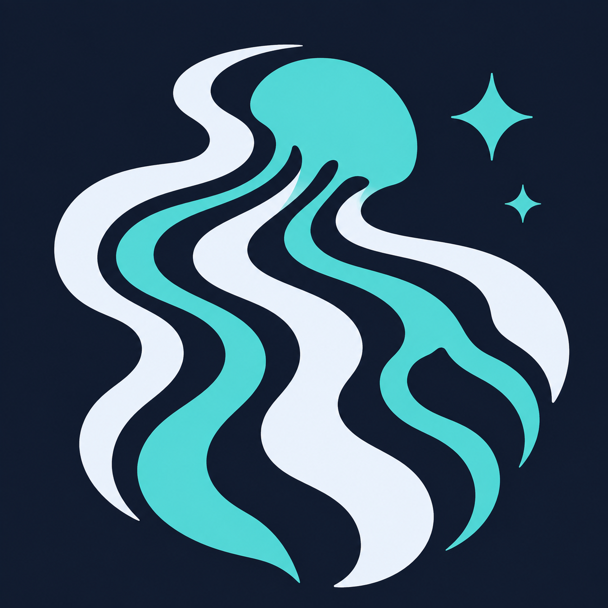
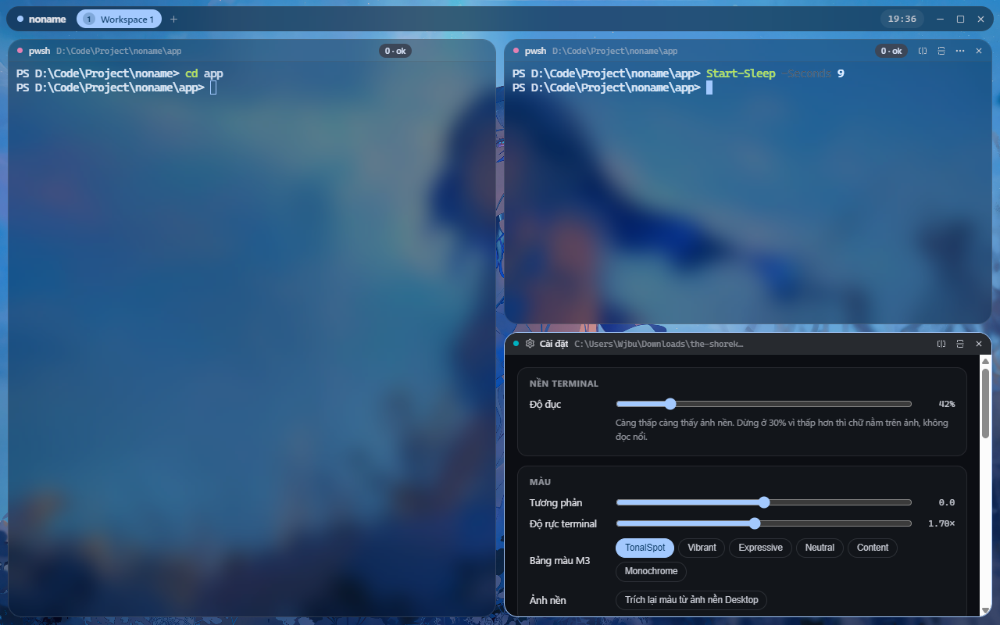
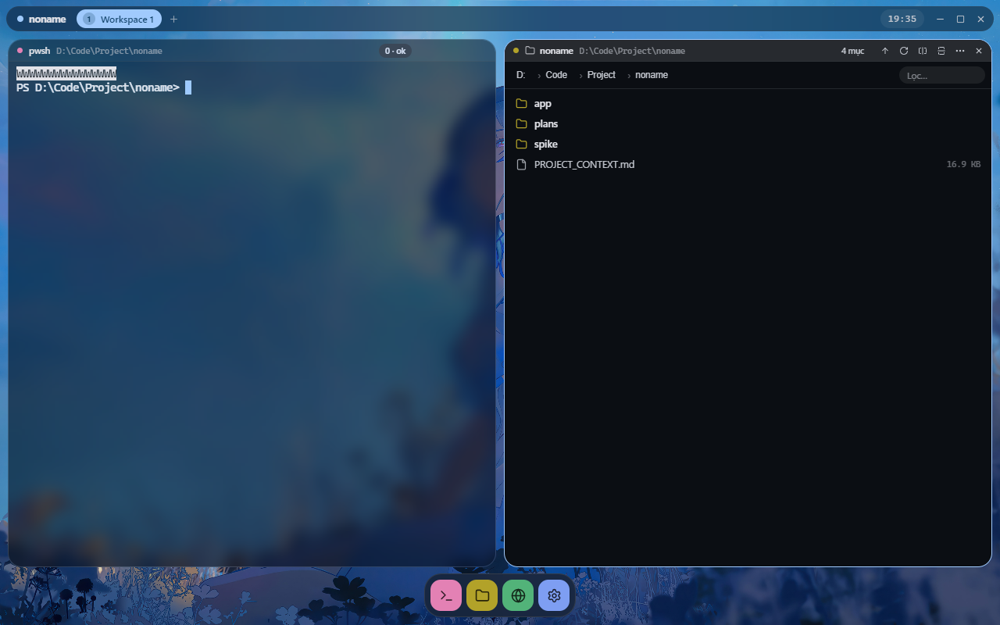
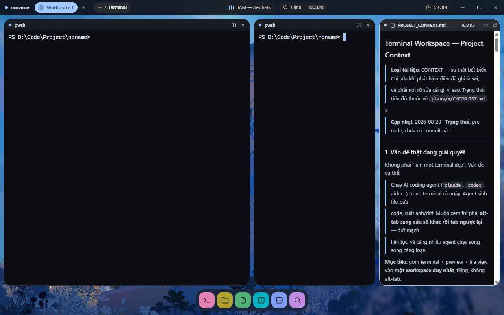
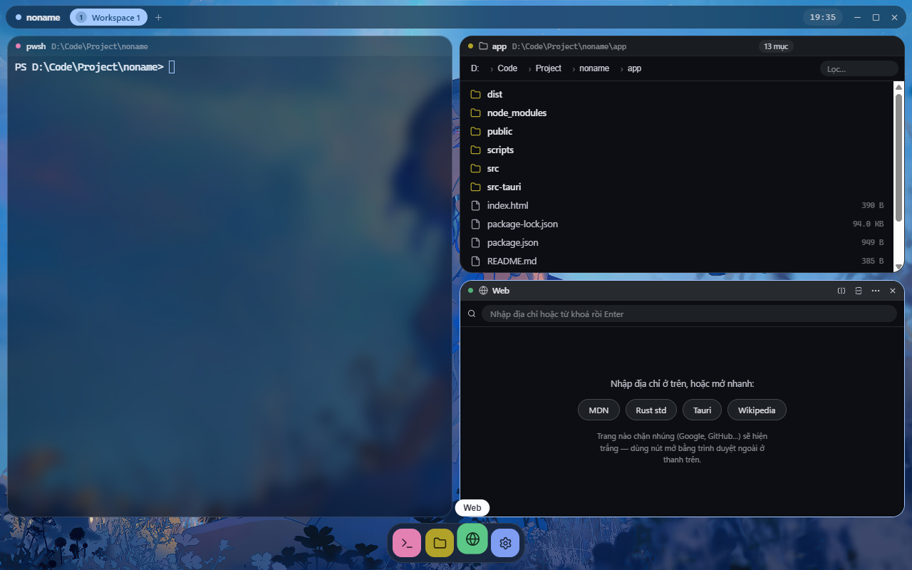

<div align="center">
  <br />
  
  <br /><br />

  # 🌌 Tethys

  **The High-Performance Tiling Workspace for AI Coding Agents & Modern Developers ⚡**

  <p>
    <a href="https://github.com/QuangquyNguyenvo/Tethys/releases/latest" target="_blank" rel="noopener noreferrer">
      
    </a>
    <a href="https://github.com/QuangquyNguyenvo/Tethys/blob/main/LICENSE">
      
    </a>
    <a href="https://github.com/QuangquyNguyenvo/Tethys">
      
    </a>
    <a href="https://tauri.app" target="_blank" rel="noopener noreferrer">
      
    </a>
    <a href="https://www.rust-lang.org" target="_blank" rel="noopener noreferrer">
      
    </a>
  </p>
</div>

<br />

<div align="center">
  ★ 。＼｜／。★
  <br/>
  <b>One single tiling window. No Alt-Tab. Pure agentic flow. 🚀</b>
  <br/>
  ★ 。／｜＼。★
</div>

<br />

<div align="center">
  
</div>

<br />

<div align="center">
  <p>
    <a href="#-about">About</a> •
    <a href="#-why-tethys">Why Tethys?</a> •
    <a href="#-features">Features</a> •
    <a href="#-screenshots">Screenshots</a> •
    <a href="#-download--installation">Download & Install</a> •
    <a href="#-shortcuts">Shortcuts</a> •
    <a href="#-development">Development</a>
  </p>
</div>

<br />

## 🎯 About

<table>
  <tr>
    <td width="72%">
      <p>
        <b>Tethys</b> is a high-performance tiling developer workspace built specifically to eliminate the friction of working with AI coding agents (<code>claude</code>, <code>aider</code>, <code>codex</code>, etc.).
      </p>
      <p>
        Instead of constantly <b>Alt-Tabbing</b> between your terminal, file explorer, image viewers, diff inspect tools, and browser windows, Tethys merges them all into <b>one seamless, hardware-accelerated tiling canvas</b>.
      </p>
      <blockquote>
        💡 <i>Terminal is not the whole app — it is a first-class citizen inside an intelligent tiling workspace.</i>
      </blockquote>
    </td>
    <td width="28%" align="center">
      
    </td>
  </tr>
</table>

<br />

## 💡 Why Tethys?

When you run AI coding agents throughout the day, agents generate files, refactor code, create diagrams, and output diffs. Traditional terminal emulators force you to tab out constantly.

```
Traditional Workflow (Friction & Chaos):
[ Terminal ] ──(Alt-Tab)──> [ File Viewer ] ──(Alt-Tab)──> [ Web Browser ] ──(Alt-Tab)──> [ Diff Tool ]

Tethys Unified Workspace (Zero Context Switching):
┌─────────────────────────── Tethys Workspace ───────────────────────────┐
│ ┌─ Terminal (ConPTY) ──┐ ┌─ Live Preview ────────┐ ┌─ Web / Diff ────┐ │
│ │ > claude --auto      │ │ 📄 Generated docs.md  │ │ 🌐 localhost:3000│ │
│ │ Agent editing...     │ │ 🖼️ Generated chart.png│ │ 🔍 Git Changes   │ │
│ └──────────────────────┘ └───────────────────────┘ └─────────────────┘ │
└────────────────────────────────────────────────────────────────────────┘
```

| Criterion | Standard Terminals (WT, Alacritty) | Heavy Electron Workspaces | 🌌 Tethys |
| :--- | :--- | :--- | :--- |
| **Primary Goal** | Pure terminal emulation | Heavy multi-agent IDE | **AI Agent Tiling Workspace** |
| **Memory Footprint** | Low (~40–80 MB) | High (400–900 MB+) | **Ultra Low (~60–120 MB)** |
| **Agent Previews** | ❌ None (Alt-Tab required) | ⚠️ Slow / Web-based | **⚡ Instant Native Watcher** |
| **Core Architecture**| Single terminal window | Electron + Daemon + SQLite | **Single-process Tauri v2 + Rust** |
| **Visual Aesthetics** | Basic themes / ANSI colors | Fixed UI styling | **Material You Dynamic Colors + Mica**|

<br />

## ✨ Features

- 🪟 **Intuitive Tiling Engine** — Split vertically, horizontally, or drag-and-drop panels freely to organize your multi-agent development environment.
- 🚀 **Blazing Native ConPTY Core** — Powered directly by Rust `portable-pty` with optimized 8–16ms binary channel flushes for near-zero latency.
- ⚡ **GPU-Accelerated Terminal** — Built with `xterm.js` and `@xterm/addon-webgl` for crisp typography and buttery-smooth 60+ FPS rendering.
- 👁️ **Live Agent Watcher & Previews** — Real-time auto-refresh for Markdown documents, generated images (PNG/SVG), and side-by-side Git Diffs without leaving your workspace.
- 🎨 **Material You Dynamic Theming** — Smart color extraction from your active desktop wallpaper or custom accent palettes with Windows 11 Acrylic & Mica transparency.
- 🔍 **OSC 133 Shell Integration** — Semantic command blocks, execution status indicators, click-to-copy outputs, and effortless command navigation (PowerShell 7 optimized).
- 🌐 **Embedded Web & System Panels** — Test local web servers with built-in preview and monitor system resources & ASCII audio visualizer widgets.
- ⌨️ **Omni Command Palette (`Ctrl+Shift+P`)** — Fast keyboard-driven panel layout management, theme switching, and quick session navigation.
- 💾 **Zero-Daemon Session Persistence** — Fast local SQLite storage saves your panel layouts, command history, and themes with zero background battery drain.

<br />

## 📸 Screenshots

<div align="center">
  
  <br /><br />
  
  
  <br /><br />
  
</div>

<br />

## 📥 Download & Installation

### 🪟 Windows (Pre-built Release)

> 💡 **Zero complex setup.** Download the standalone executable or installer and launch immediately.

1. Head over to the **[Latest GitHub Releases](https://github.com/QuangquyNguyenvo/Tethys/releases/latest)**.
2. Download `Tethys_x64_en-US.msi` (Installer) or `Tethys_portable.zip` (Standalone).
3. Run `Tethys.exe` and begin your streamlined coding sessions!

#### 💡 Shell Recommendation
For the optimal OSC 133 command block experience, we recommend **PowerShell 7 (`pwsh`)**:
```powershell
winget install Microsoft.PowerShell
```

<br />

## ⌨️ Shortcuts

| Shortcut | Action |
| :--- | :--- |
| <kbd>Ctrl</kbd> + <kbd>Shift</kbd> + <kbd>P</kbd> / <kbd>Ctrl</kbd> + <kbd>P</kbd> | Open Command Palette |
| <kbd>Ctrl</kbd> + <kbd>\</kbd> | Split Active Panel Horizontally |
| <kbd>Ctrl</kbd> + <kbd>Shift</kbd> + <kbd>D</kbd> | Split Active Panel Vertically |
| <kbd>Ctrl</kbd> + <kbd>W</kbd> | Close Current Focused Panel |
| <kbd>Alt</kbd> + <kbd>←</kbd> / <kbd>→</kbd> / <kbd>↑</kbd> / <kbd>↓</kbd> | Navigate focus across tiled panels |
| <kbd>Ctrl</kbd> + <kbd>Tab</kbd> | Cycle through active panels |
| <kbd>Ctrl</kbd> + <kbd>+</kbd> / <kbd>-</kbd> | Zoom In / Zoom Out Terminal font size |
| <kbd>F11</kbd> | Toggle Fullscreen Mode |

<br />

<div align="center">
  
</div>

<br />

## 🛠️ Development

If you wish to build Tethys from source or contribute to development:

### Prerequisites

- **Node.js**: v18.0.0 or higher
- **Rust**: 1.75+ with Cargo toolchain (`rustup`)
- **C++ Build Tools**: Visual Studio C++ Build Tools (Windows)

### Setup & Run Locally

```bash
# 1. Clone the repository
git clone https://github.com/QuangquyNguyenvo/Tethys.git
cd Tethys

# 2. Navigate to the app directory and install dependencies
cd app
npm install

# 3. Launch Tethys in development mode (Vite + Tauri dev)
npm run tauri dev
```

### Production Build

```bash
# Build optimized native binary and MSI bundle
npm run tauri build
```
The compiled output and installer will be located in `app/src-tauri/target/release/bundle/`.

<br />

## 🤝 Contributing

Contributions, bug reports, and feature requests are warmly welcomed!

- 🐛 Found a bug? [Open an Issue](https://github.com/QuangquyNguyenvo/Tethys/issues)
- 💡 Have an idea? [Submit a Feature Request](https://github.com/QuangquyNguyenvo/Tethys/discussions)
- 🔧 Want to submit code? Please fork the repo, create a feature branch, and submit a PR.

<br />

## 📄 License

This project is licensed under the **MIT License** — see the [LICENSE](LICENSE) file for details.

<div align="center">
  <br />
  Made with 💜 and 🌌 by <a href="https://github.com/QuangquyNguyenvo"><b>QuangquyNguyenvo</b></a>
  <br /><br />
  <a href="#-tethys">Back to Top ↑</a>
</div>
